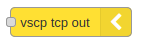

[](http://choosealicense.com/licenses/mit/)
[](https://travis-ci.org/grodansparadis/node-red-contrib-vscp-tcp)


# node-red-contrib-vscp-tcp
VSCP tcp/ip interface input/output nodes for node-red that can receive/transmit events from/to a VSCP daemon or host.

This assumes you have Node-RED already installed and working, if you need to install Node-RED see [here](https://nodered.org/docs/getting-started/installation)

This software is part of the [VSCP (Very simple control protocol)](https://www.vscp.org) framework.

## Installation

Install via Node-RED Manage Palette

```
node-red-contrib-vscp-tcp
```

Install with npm

```
$ cd ~/.node-red
$ npm node-red-contrib-vscp-tcp
# Restart node-red
```

Full documentation for VSCP is available at [https://docs.vscp.org](https://docs.vscp.org) and downloads can be found at [https://download.vscp.org](https://download.vscp.org)

## Usage

## VSCP tcp/ip input node


The VSCP tcp/ip input node connects to a VSCP daemon/server or some other host and open a connection that will receive events from attached hardware devices.

### How to use
Specify a host that you want to connect to. It is defined by an url and a port. You can also set keep alive and tls usage as well as a connection timeout.

With keep alive activated the node will try to automatically reconnect to the remote host if the connection drops. The timeout used is the same as for connect.

It is possible to set a filter to just receive the events that your program wants to receive.

## VSCP tcp/ip output node



The VSCP tcp/ip input node connects to a VSCP daemon/server or host and open a connection that will allow your code to send VSCP events to hardware that is attached to the daemon/server or host.

### To use
Specify a host that you want to connect to. It is defined by an url and a port. You can also set keep alive and tls usage as well as a connection timeout.

When the connection is active you can send events to the remote host.

## VSCP & friends
The VSCP subsystem consist of many system components. 

### VSCP Daemon
The VSCP daemon is a central piece of software that act as a hub for VSCP based hardware or hardware that abstract as VSCP hardware, You can find the documentation for the VSCP daemon [here](https://docs.vscp.org/#vscpd).

### VSCP Works
VSCP works is a tool that make sinteraction with VSCP system components easy. VSCP Works is documented [here](https://docs.vscp.org/#vscpworks).

### VSCP Helper library
The VSCP helper library is a c/c++ library with common VSCP functionality. It is available for Python to and will be available for PHP and node.js. It is documented [here](https://docs.vscp.org/#vscphelper);  

### More
There is plenty of other tools available in the VSCP subsystem. Check the docs and the downloads.

### Other VSCP node-red nodes

There are other node-red parts in development or already available that makes it possible to easily connect6 to websocket interfaces on remote VSCP daemons/servers or hosts.

Checkout [node-red-contrib-vscp](https://www.npmjs.com/package/node-red-contrib-vscp) that contains several helper nodes useful for working with VSCP.

If you work with CAN, and especially CAN4VSCP, you might find [node-red-contrib-socketcan](https://www.npmjs.com/package/node-red-contrib-socketcan) and  [node-red-contrib-canal](https://www.npmjs.com/package/node-red-contrib-canal) useful.

---
Copyright © 2000-2020 Åke Hedman, Grodans Paradis AB
