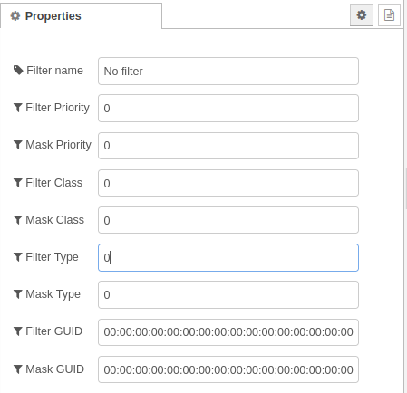
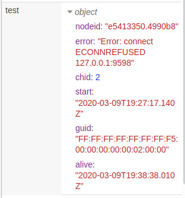
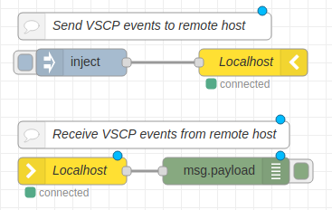

[](http://choosealicense.com/licenses/mit/)
[](https://travis-ci.org/grodansparadis/node-red-contrib-vscp-tcp)


# node-red-contrib-vscp-tcp
VSCP tcp/ip interface input/output nodes for node-red that can receive/transmit events from/to a VSCP daemon or host. It is a perfect companion to [the other node.js modules](https://www.npmjs.com/settings/akhe/packages) that are available for VSCP.

This assumes you have Node-RED already installed and working, if you need to install Node-RED see [here](https://nodered.org/docs/getting-started/installation)

This software is part of the [VSCP (Very simple control protocol)](https://www.vscp.org) framework.

## Installation

Install via Node-RED Manage Palette

```
node-red-contrib-vscp-tcp
```

Install with npm

```
$ cd ~/.node-red
$ npm node-red-contrib-vscp-tcp
# Restart node-red
```

Full documentation for VSCP is available at [https://docs.vscp.org](https://docs.vscp.org) and downloads can be found at [https://download.vscp.org](https://download.vscp.org)


## VSCP tcp/ip input node


The VSCP tcp/ip input node connects to a VSCP daemon/server or some other VSCP host and open a connection that will receive VSCP events from hardware and other systems that is attached to the remote daemon/server or host.

### How to use
Specify a **host** that you want to connect to. It is defined by an url and a port and credentials in the form of a username and a password. You can also set keep alive and tls usage as well as a connection timeout. The host settings are common for all nodes.

If you just want to receive certain events or events from certain remote interfaces you should specify a filter. You can read more about [VSCP filters here](). If you want to receive everything from the remote host just use a all nill filter.



With a **keepalive** value set the node will try to automatically reconnect to the remote host if the connection drops. USeful for a static setup.

The **context key** is a node-red flow context location where a vscp tcp input node will save the channel id of it's connection with a remote host. If the same context key is used for a vscp tcp output node then the receiving node will not receive events sent through that node. Some other values is also saved in the specified context.

  * **nodeid** - This is the node-red nodeid for the input node.
  * **chid** - The channel id for the input nodes connection channel to the remote host.
  * **start** - When the input node was started.
  * **alive** - Last time the remote host was confirmed to be alive. This should be approximate one minute intervals if all is OK.
  * **error** - Last error message.

Two input node should **NEVER** have the same context key.

Typically the node-red flow context looks like this for an input node.



It is possible to set a **filter** to just receive the events that your program wants to receive.

Received VSCP events typically have the the following content

```javascript
{   
   "vscpHead":0,
   "vscpObId":0,
   "vscpClass":10,
   "vscpType":6,
   "vscpGuid":"ff:ee:dd:cc:bb:aa:99:88:77:66:55:44:33:22:11:00",
   "vscpTimeStamp":1234567,
   "vscpDateTime":"2018-03-03T12:01:40Z",
   "vscpData":[1,2,3,4],
}
```

## VSCP tcp/ip output node


The VSCP tcp/ip output node connects to a VSCP daemon/server or other remote VSCP host and open a connection that will allow your system to send VSCP events to the remote daemon/server or host.

### How to use

Specify a **host** that you want to connect to. It is defined by an url and a port and credentials in the form of a username and a password. You can also set keep alive and tls usage as well as a connection timeout. The host settings are common for all nodes.

With a **keepalive** value set the node will try to automatically reconnect to the remote host if the connection drops. Useful for a static setup.

The **context key** is a node-red flow context location where a vscp tcp input node will save the channel id of it's connection with a remote host. When the same context key is used for a vscp tcp output node then the receiving node will not receive events sent through that node. 

When all is setup just startt to send VSCP event object. They are of the form

```javascript
{   
   "vscpHead":0,
   "vscpObId":0,
   "vscpClass":10,
   "vscpType":6,
   "vscpGuid":"ff:ee:dd:cc:bb:aa:99:88:77:66:55:44:33:22:11:00",
   "vscpTimeStamp":1234567,
   "vscpDateTime":"2018-03-03T12:01:40Z",
   "vscpData":[1,2,3,4],
}
```

and missing elements will get sensible defaults. More info is [here](https://docs.vscp.org/spec/latest/#/./vscp_level_ii_specifics?id=json-representation).

## Example flow



```javascript
[{"id":"e5413350.4990b8","type":"vscp-tcp-in","z":"d3031d1c.e9ffa8","name":"Localhost","host":"7086bddc.029724","username":"admin","password":"__PWRD__","filter":"7035a605.025848","keyctx":"test","x":120,"y":200,"wires":[["5eee7c0.c0a4e04"]]},{"id":"5eee7c0.c0a4e04","type":"debug","z":"d3031d1c.e9ffa8","name":"","active":true,"tosidebar":true,"console":false,"tostatus":false,"complete":"payload","targetType":"msg","x":290,"y":200,"wires":[]},{"id":"7713648.9cb649c","type":"vscp-tcp-out","z":"d3031d1c.e9ffa8","name":"Localhost","host":"7086bddc.029724","username":"admin","password":"__PWRD__","keyctx":"test","x":320,"y":80,"wires":[]},{"id":"38684d25.86237a","type":"inject","z":"d3031d1c.e9ffa8","name":"","topic":"","payload":"{\"vscpHead\":0,\"vscpClass\":10,\"vscpType\":6,\"vscpGuid\":\"-\",\"vscpData\":[15,14,13,12,11,10,9,8,7,6,5,4,3,2,0,0,1,35]}","payloadType":"json","repeat":"","crontab":"","once":false,"onceDelay":0.1,"x":130,"y":80,"wires":[["7713648.9cb649c"]]},{"id":"44cbb86.e5435c8","type":"comment","z":"d3031d1c.e9ffa8","name":"Send VSCP events to remote host","info":"","x":200,"y":40,"wires":[]},{"id":"888daac0.bd4df","type":"comment","z":"d3031d1c.e9ffa8","name":"Receive VSCP events from remote host","info":"","x":210,"y":160,"wires":[]},{"id":"7086bddc.029724","type":"vscp-tcp-config-host","z":"","name":"Localhost","host":"127.0.0.1","port":"9598","timeout":"10000","interface":"","keepalive":"5000"},{"id":"7035a605.025848","type":"vscp-tcp-config-filter","z":"","name":"No filter","filterPriority":"0x12345","maskPriority":"0","filterClass":"0","maskClass":"0","filterType":"0x1234","maskType":"0","filterGuid":"00:00:00:00:00:00:00:00:00:00:00:00:00:00:00:00","maskGuid":"00:00:00:00:00:00:00:00:00:00:00:00:00:00:00:00"}]
```

## VSCP & friends
The VSCP subsystem consist of many system components. 

### VSCP Daemon
The VSCP daemon is a central piece of software that act as a hub for VSCP based hardware or hardware that abstract as VSCP hardware, You can find the documentation for the VSCP daemon [here](https://docs.vscp.org/#vscpd).

### VSCP Works
VSCP works is a tool that make sinteraction with VSCP system components easy. VSCP Works is documented [here](https://docs.vscp.org/#vscpworks).

### VSCP Helper library
The VSCP helper library is a c/c++ library with common VSCP functionality. It is available for Python to and will be available for PHP and node.js. It is documented [here](https://docs.vscp.org/#vscphelper);  

### More
There is plenty of other tools available in the VSCP subsystem. Check the docs and the downloads.

### Other VSCP node-red nodes

There are other node-red parts in development or already available that makes it possible to easily connect6 to websocket interfaces on remote VSCP daemons/servers or hosts.

Checkout [node-red-contrib-vscp](https://www.npmjs.com/package/node-red-contrib-vscp) that contains several helper nodes useful for working with VSCP.

If you work with CAN, and especially CAN4VSCP, you might find [node-red-contrib-socketcan](https://www.npmjs.com/package/node-red-contrib-socketcan) and  [node-red-contrib-canal](https://www.npmjs.com/package/node-red-contrib-canal) useful.

---
Copyright © 2000-2020 Åke Hedman, Grodans Paradis AB
